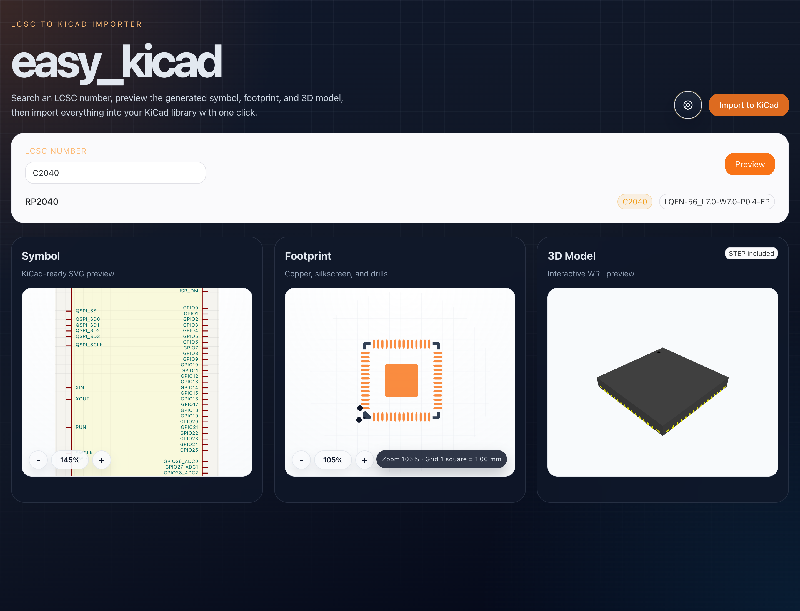

# easy_kicad



`easy_kicad` is a desktop-style importer that takes an LCSC part number,
previews the generated KiCad assets, and imports the symbol, footprint, and 3D
model into a local KiCad library in one flow.

It is built around
[`easyeda2kicad.py`](https://github.com/uPesy/easyeda2kicad.py),
with a Python desktop backend and a Vue 3 + Naive UI frontend.

## What You Get

- LCSC part lookup with one-click inspect
- Inline symbol preview
- Inline footprint preview
- WRL-based 3D preview
- Import into a KiCad symbol library, footprint library, and 3D model folder
- Settings for library path, proxy, CA bundle, SSL ignore, overwrite mode, and symbol format
- `pytest` coverage for API, import flow, preview rendering, settings storage, and release packaging
- GitHub Actions CI that validates the app and produces Linux, Windows, and macOS PyInstaller bundles

## Stack

- Backend: Python, FastAPI, `easyeda2kicad`, `pywebview`
- Frontend: Vue 3, TypeScript, Naive UI, three.js, Vite
- Python package management: `uv`
- Desktop packaging: PyInstaller

## Quick Start

### 1. Install the recommended Python runtime

```bash
uv python install 3.11
```

### 2. Sync Python dependencies

```bash
UV_CACHE_DIR=.uv-cache uv sync --group dev
```

### 3. Install and build the frontend

```bash
cd frontend
npm install
npm run build
cd ..
```

### 4. Run the app

Desktop window:

```bash
UV_CACHE_DIR=.uv-cache uv run easy-kicad
```

Browser/server only:

```bash
UV_CACHE_DIR=.uv-cache uv run easy-kicad --serve-only --port 8765
```

Open [http://127.0.0.1:8765](http://127.0.0.1:8765) if you are using server-only mode.

## Test

```bash
UV_CACHE_DIR=.uv-cache uv run pytest
```

## Build A Desktop Bundle

Build the frontend first, then package the desktop app:

```bash
cd frontend
npm run build
cd ..
UV_CACHE_DIR=.uv-cache uv run pyinstaller easy_kicad.spec --noconfirm
UV_CACHE_DIR=.uv-cache uv run python scripts/build_release.py
```

PyInstaller produces an onedir bundle in `dist/easy_kicad/`, and the helper
script wraps that bundle into a platform-specific archive in `release/`.

Windows debug bundle with console logging:

```bash
EASY_KICAD_BUILD_VARIANT=debug UV_CACHE_DIR=.uv-cache \
uv run pyinstaller easy_kicad.spec --noconfirm --distpath dist-debug --workpath build-debug
UV_CACHE_DIR=.uv-cache uv run python scripts/build_release.py --dist-dir dist-debug/easy_kicad_debug --variant debug
```

## GitHub Setup

This repository includes:

- `.github/workflows/ci.yml` for push and pull request validation plus cross-platform desktop bundle artifacts
- `.github/workflows/release.yml` for tag-based Linux, Windows, and macOS release archives
- `.github/ISSUE_TEMPLATE/` for bug reports and feature requests
- `.github/pull_request_template.md` for a consistent review checklist

Recommended release flow:

1. Push to your default branch and let CI verify tests and packaging.
2. Tag a version like `v0.1.0`.
3. Push the tag to GitHub.
4. GitHub Actions will build desktop archives for each target OS and attach them to the release.

Current packaged targets:

- `ubuntu-24.04` -> `easy_kicad-<version>-linux-x64.tar.gz`
- `windows-2025` -> `easy_kicad-<version>-windows-x64.zip`
- `windows-2025` debug -> `easy_kicad-<version>-windows-x64-debug.zip`
- `macos-15` -> `easy_kicad-<version>-macos-arm64.tar.gz`

## Branding Surfaces

If you want to rebrand the app later, the main rename points are centralized:

- Python app metadata: `src/easy_kicad/metadata.py`
- Frontend marketing copy: `frontend/src/branding.ts`
- README app screenshot: `docs/assets/easy_kicad-ui.png`
- App icon source: `docs/assets/icons/easy_kicad-icon.svg`
- Default KiCad library name: `src/easy_kicad/schemas/settings.py`

## Project Layout

```text
.github/                 GitHub Actions and repository templates
docs/assets/             README artwork
frontend/                Vue + TypeScript + Naive UI source
scripts/                 Build helpers used by CI and local packaging
src/easy_kicad/          FastAPI app, desktop launcher, services
src/easy_kicad/web/      Built frontend assets served by FastAPI
tests/                   pytest-based unit and API tests
```

## Notes

- 3D preview is based on WRL for fast in-app rendering.
- STEP files are still exported during import when available.
- Preview rendering is optimized for quick inspection rather than pixel-perfect KiCad parity.
- If you previously created `.venv` with macOS system Python 3.9, recreate it with `uv sync --python 3.11 --group dev` to avoid LibreSSL-related `urllib3` warnings.
- Linux packaging now pulls in the Qt renderer for `pywebview` so GitHub Actions can produce a desktop bundle without relying on a system GTK Python binding.
- Windows packaging also uses the Qt backend for `pywebview` to avoid the WinForms/pythonnet startup path in frozen builds.

## License

`easy_kicad` is released under the GNU Affero General Public License v3.0 or later.
That choice keeps the project aligned with the licensing obligations of
`easyeda2kicad.py`.
